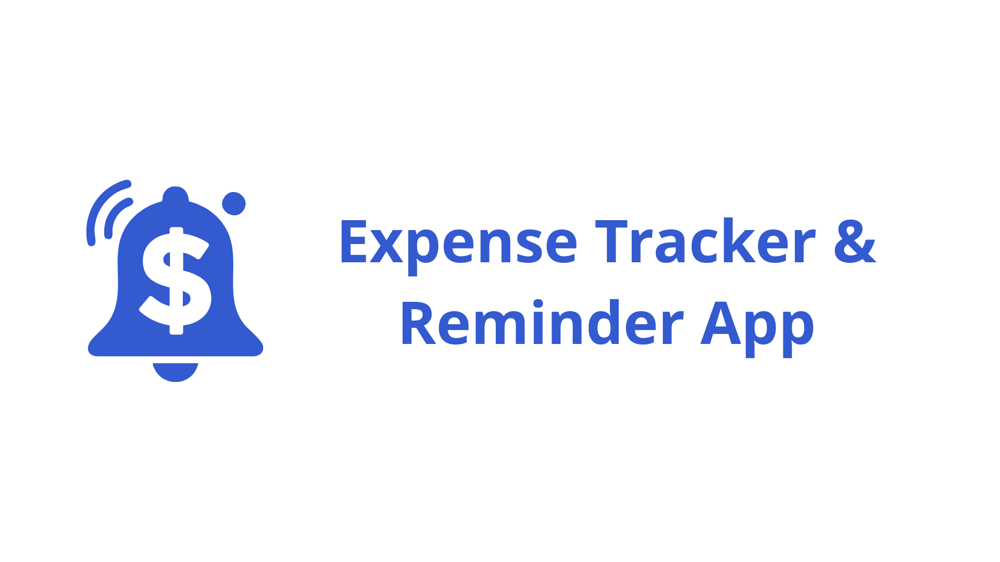
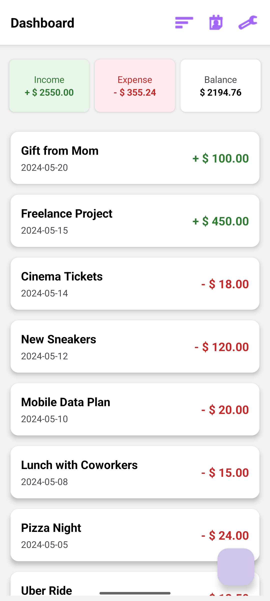
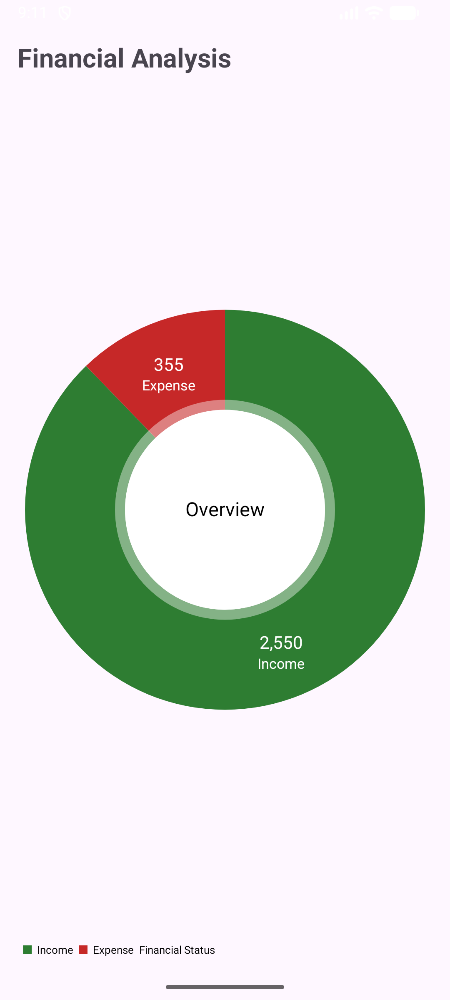
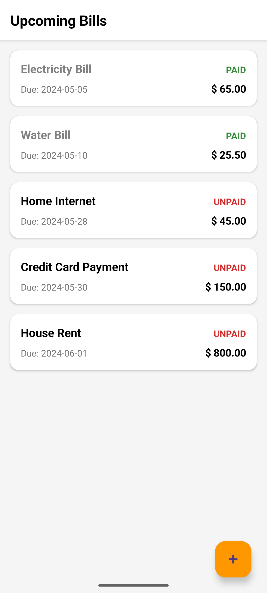

# Expense Tracker & Reminder App

A comprehensive Android application designed to help users manage their personal finances, track daily income and expenses, analyze spending habits via charts, and manage upcoming bill reminders.

This project uses a **Client-Server Architecture** with a native Android Client (Kotlin) and a custom Backend API (PHP/MySQL).

 

## Features

*   **User Authentication:** Secure Login and Registration system using MySQL.
*   **Dashboard:** Real-time overview of Total Income, Total Expense, and Current Balance.
*   **Transaction Management:** Add and view daily income/expense records with color-coded visual cues.
*   **Analytics:** Visual breakdown of finances using a Pie Chart (integrated with MPAndroidChart).
*   **Bill Reminders:** Manage upcoming bills, mark them as 'Paid'/'Unpaid', and delete obsolete records.
*   **Settings:**
    *   **Currency Conversion:** Toggle globally between USD ($) and VND (₫).
    *   **Logout:** Securely clear user session.
*   **Online Storage:** All data is synced to a MySQL database via RESTful APIs.

## Tech Stack

### Android Client
*   **Language:** Kotlin
*   **Architecture:** MVVM (Model-View-ViewModel)
*   **Networking:** Retrofit 2 & OkHttp (with timeout & retry logic)
*   **Concurrency:** Kotlin Coroutines
*   **UI Components:** ViewBinding, Navigation Component, RecyclerView, CardView.
*   **Chart Library:** MPAndroidChart

### Backend
*   **Server:** Apache (via WampServer)
*   **Language:** PHP 8.0+
*   **Database:** MySQL
*   **Format:** JSON

## Installation & Setup Guide

Since this project uses a local server, follow these steps strictly to run the app.

### Prerequisites
1.  **Android Studio** (Koala/Ladybug or newer).
2.  **WampServer**
3.  **Git** installed.

### Step 1: Backend Setup (PHP & MySQL)

1.  **Locate the API Code:**
    *   Navigate to the `Additional_Files` folder in this repository.
    *   Copy the folder `expense_api` into your server's root directory:
        *   **WampServer:** `C:\wamp64\www\expense_api\`

2.  **Database Configuration:**
    *   Start your WampServer (Ensure Apache and MySQL are green).
    *   Open **phpMyAdmin** in your browser (`http://localhost/phpmyadmin`).
    *   Create a new database named: `expense_tracker_db`.
    *   Click on the SQL tab and run the script found in `Additional_Files\schema.sql`

3.  **Check Connection:**
    *   Open your browser and visit: `http://localhost/expense_api/db_connect.php`
    *   If the page is **Blank/White**, the connection is successful.
    *   If you see an error, check your `db_connect.php` file (username/password).

### Step 2: Android Setup

1.  **Clone the Repository:**
    ```bash
    git clone https://github.com/AnChuTuan/Expense_Tracker_ITCI
    ```
2.  **Open in Android Studio:**
    *   Open Android Studio -> File -> Open -> Select the project folder.
    *   Let Gradle sync completely.

3.  **Configure IP Address (Crucial):**
    *   The app is configured to work with the **Android Emulator**.
    *   In `data/api/RetrofitClient.kt`, ensure the Base URL is:
        ```kotlin
        private const val BASE_URL = "http://10.0.2.2/expense_api/"
        ```
    *   *Note: `10.0.2.2` is the special IP that allows the Emulator to access your computer's localhost.*

4.  **Run the App:**
    *   Select an Emulator (e.g., Pixel 4 API 33).
    *   Click the **Run** (Play) button.

## SAMPLE ACCOUNT
| Email | Password |
|:---:|:---:|
| demo@gmail.com | 123456 |

## Project Structure

```
com.example.expensetracker
├── data                # Data Layer
│   ├── api             # Retrofit Service & Client
│   └── model           # Data Classes (User, Expense, Bill)
├── ui                  # UI Layer (Fragments & ViewModels)
│   ├── login           # Authentication
│   ├── home            # Dashboard & Expense List
│   ├── stats           # Charts & Analytics
│   ├── bills           # Bill Reminders
│   ├── settings        # Currency & Logout
│   └── MainActivity.kt # Container Activity
├── utils               # Utilities (SessionManager)
└── worker              # Background Workers
```

## Screenshots

| Login | Dashboard | Analytics | Bills |
|:---:|:---:|:---:|:---:|
|  |  |  |  |

## Contributors

*   **Chu Tuan An** - Team Lead - Backend Logic & Database
*   **Le Khanh Thanh** - UI/UX Design & Navigation
*   **Duong Tan Tai** - Advanced Features (Analytics, Bills)

## License

This project is created for educational purposes as part of the Mobile Device Application Development course, International Training & Cooperation Institute, East Asia University of Technology

---

